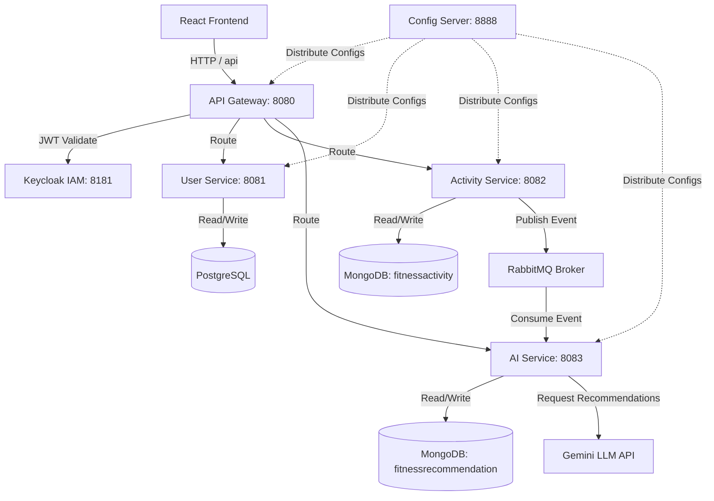

# Fitness Tracker AI Microservices

An advanced, secure, and AI-driven fitness tracking application built on a modern microservices architecture. The platform tracks workouts, stores user activity logs, and leverages artificial intelligence to generate personalized workout recommendations, fitness safety tips, and conversational coaching.


---

## ℹ️ About the Project

**Fitness Tracker AI Microservices** is a state-of-the-art, secure fitness and wellness ecosystem designed to demonstrate modern enterprise microservice patterns combined with generative AI integration. 

Unlike traditional monolith applications, this platform partitions operations into specialized domain services to maximize scalability, fault isolation, and developer agility. 

### 🌟 Core Value Propositions
* **Security at the Edge**: Relies on Keycloak OAuth2 Identity Provider. All microservices are hidden behind a secure API Gateway, which handles JWT token validation using a PKCE flow.
* **Asynchronous & Decoupled Event Pipeline**: When a workout is logged in the `activityservice`, it immediately publishes a message to a RabbitMQ exchange. The UI receives an instant confirmation. In the background, the `aiservice` consumes the event, coordinates with the LLM API, parses the recommendation, and writes it to the database asynchronously.
* **Intelligent Feedback Loops**: Leverages generative AI models to deliver structured analysis of metrics (calories, heart rate, Rate of Perceived Exertion) and keeps chat history context for personalized wellness coaching.
* **Polyglot Persistence**: 
  * **PostgreSQL** is utilized in the `userservice` for consistent, relational data structures (user profiles, credentials).
  * **MongoDB** is utilized in `activityservice` and `aiservice` for high-throughput, unstructured documents (activity logs, structured AI recommendations, and chat histories).

---

## 🏗️ Architecture Overview

The system consists of a React frontend and a set of Spring Boot microservices backed by PostgreSQL, MongoDB, and RabbitMQ. Identity and access management are handled centrally via Keycloak.



### Services Directory

| Service | Port | Database / Broker | Key Technologies | Description |
| :--- | :---: | :--- | :--- | :--- |
| **`eureka`** | `8761` | None | Spring Cloud Netflix Eureka | Service Registry for dynamic service discovery and resolution. |
| **`configserver`** | `8888` | Local file system (`native`) | Spring Cloud Config Server | Centralized configuration management using files in `classpath:/config`. |
| **`gateway`** | `8080` | None | Spring Cloud Gateway, OAuth2 | Application Gateway routing incoming requests to services with JWT authentication. |
| **`userservice`** | `8081` | PostgreSQL (`fitness_user_db`) | Spring Boot, Spring Data JPA | Handles user registration, profiles, and basic user data. |
| **`activityservice`** | `8082` | MongoDB (`fitnessactivity`), RabbitMQ | Spring Boot, Spring Data MongoDB | Logs and tracks user activities (running, walking, etc.). Publishes updates to RabbitMQ. |
| **`aiservice`** | `8083` | MongoDB (`fitnessrecommendation`), RabbitMQ | Spring Boot, Spring WebClient | Listens to workout events, requests fitness advice from Gemini, and stores recommendations/chat. |
| **`fitness-app-frontend`** | `5173` | Local Storage | React 19, Redux, Tailwind CSS, Vite | Responsive UI dashboard for activity logging, user profile management, and AI coaching chat. |
| **Keycloak Server** | `8181` | Dev Mem / Database | Keycloak, OIDC | Central IAM provider protecting routes and microservices via OAuth2. |

---

## 🛠️ Prerequisites

Ensure you have the following installed on your machine:
- **Java Development Kit (JDK)**: Version 17 or higher
- **Node.js**: Version 18+ (includes `npm`)
- **PostgreSQL**: Running on port `5432` with a database named `fitness_user_db`
- **MongoDB**: Running on port `27017`
- **RabbitMQ**: Running on port `5672` (AMQP default port) with default `guest/guest` credentials
- **Maven**: To build the Java microservices (you can also use the packaged `./mvnw` wrappers)

---

## 🚀 Local Installation & Run Guide

To run the entire system locally, start the components in the following chronological order:

### Phase 1: Infrastructure & Databases
1. Start your local **PostgreSQL** instance. Ensure the database `fitness_user_db` is created.
2. Start your local **MongoDB** instance.
3. Start your **RabbitMQ** broker.
4. Run a local **Keycloak** instance on port `8181`. Import or configure the realm `fitness-oauth2` and client ID `oauth2-pkce-client`.

---

### Phase 2: Configuration & Service Registry
5. **Config Server (`configserver`)**
   - Central configurations are located in `configserver/src/main/resources/config`.
   - Run the server:
     ```bash
     cd configserver
     ./mvnw spring-boot:run
     ```
   - Verify it is up by visiting `http://localhost:8888/api-gateway/default`.

6. **Eureka Server (`eureka`)**
   - Run the registry:
     ```bash
     cd eureka
     ./mvnw spring-boot:run
     ```
   - Verify the dashboard at `http://localhost:8761`.

---

### Phase 3: Core Microservices
7. **User Service (`userservice`)**
   ```bash
   cd userservice
   ./mvnw spring-boot:run
   ```
8. **Activity Service (`activityservice`)**
   ```bash
   cd activityservice
   ./mvnw spring-boot:run
   ```
9. **AI Service (`aiservice`)**
   - *Requires Gemini Environment Variables:*
     ```bash
     export GEMINI_API_URL="https://generativelanguage.googleapis.com/v1beta/models/gemini-1.5-flash:generateContent"
     export GEMINI_API_KEY="your-api-key-here"
     ```
   - Run the service:
     ```bash
     cd aiservice
     ./mvnw spring-boot:run
     ```

---

### Phase 4: Gateway & Frontend
10. **API Gateway (`gateway`)**
    ```bash
    cd gateway
    ./mvnw spring-boot:run
    ```

11. **React Frontend (`fitness-app-frontend`)**
    - Navigate to the frontend directory:
      ```bash
      cd fitness-app-frontend
      npm install
      npm run dev
      ```
    - Access the application UI in your browser at `http://localhost:5173`.

---

## ⚡ AI Integration Details

The **AI Service** handles two core capabilities using the Gemini LLM API:
1. **Automated Analysis**: When a workout is logged in `activityservice`, an event is published to RabbitMQ. The `aiservice` consumes the event, passes details to Gemini with a structured JSON schema, and stores the response details (improvements, suggestions, safety tips) in MongoDB.
2. **Coaching Chat**: Live conversation under `/api/recommendations/chat/{userId}` keeping chat history to provide context-aware feedback.

---

## 🔒 Security

All network communication from the frontend goes through the API Gateway on port `8080`. The Gateway integrates with Keycloak to inspect JWT tokens sent by the client. Services expect a valid bearer token to access endpoint endpoints like `/api/users/**`, `/api/activities/**`, and `/api/recommendations/**`.
